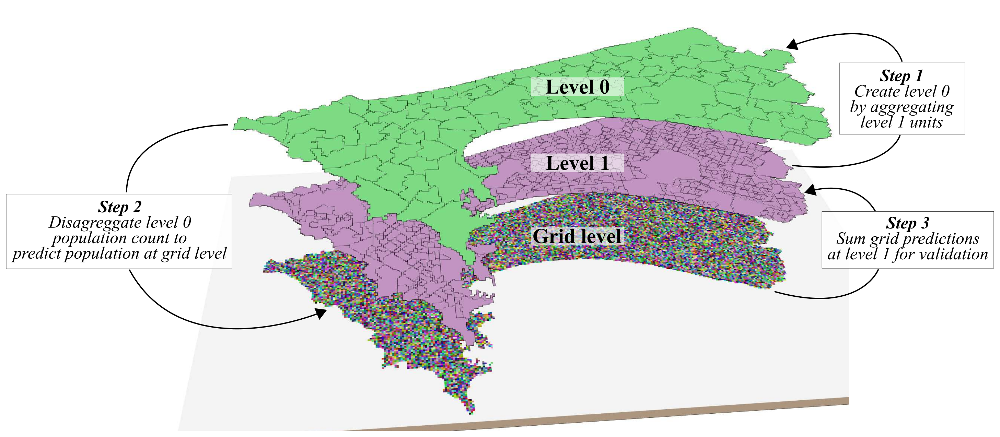
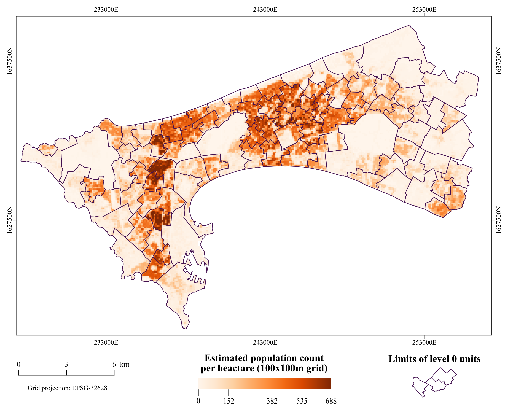

# Dasymetric mapping using GRASS GIS
This repository contains the computer code that supported the publication of our research[1]. It was used to create a gridded population product of the city of Dakar[2], using the Random Forest method as proposed by the WorldPop project [3].

 
 

## Cite this code
Please use the following DOI for citing this code 

## References
[1] Grippa, Taïs, Catherine Linard, Moritz Lennert, Stefanos Georganos, Nicholus Mboga, Sabine Vanhuysse, Assane Gadiaga, and Eléonore Wolff. “Improving Urban Population Distribution Models with Very-High Resolution Satellite Information.” Data 4, no. 1 (January 16, 2019): 13 [https://doi.org/10.3390/data4010013](https://doi.org/10.3390/data4010013).

[2] Taïs, Grippa. “Dakar Population Estimates at 100x100m Spatial Resolution - Grid  Layer - Dasymetric Mapping.” Zenodo, December 24, 2018. [https://doi.org/10.5281/zenodo.2525672](https://doi.org/10.5281/zenodo.2525672).

[2] Stevens, Forrest R, Andrea E Gaughan, Catherine Linard, and Andrew J Tatem. “Disaggregating Census Data for Population Mapping Using Random Forests with Remotely-Sensed and Other Ancillary Data.” Plos One, February 17, 2015. [https://doi.org/10.1371/journal.pone.0107042](https://doi.org/10.1371/journal.pone.0107042).

## Related code
This repository contain some pieces of code that are also available in this repository: [https://github.com/tgrippa/Aggregate_polygons](https://github.com/tgrippa/Aggregate_polygons).